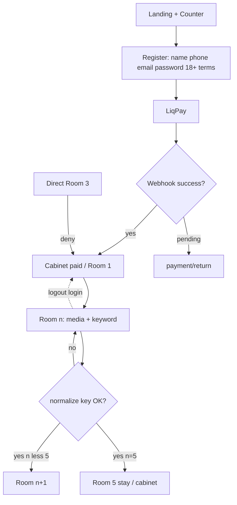

# Карта сайту — «Квест-марафон»

> Єдине джерело правди для маршрутів, доступу, інтеграцій і UI-каркасу.  
> Стек: **Python / Django + HTML / CSS / JS / HTMX**. Без CMS-конструкторів і SPA.

---

## 1. Продукт і зафіксовані рішення

**Назва:** Квест-марафон  
**Суть:** інтерактивна платформа лінійного онлайн-квесту (5 кімнат). Контент завдань може бути різним: питання, ребуси, загадки, графічні головоломки, PDF/зображення/аудіо/відео — структура сторінки однакова.

```
Гість → Реєстрація → LiqPay → Webhook «paid»
      → Кімната 1 → ключ → … → Кімната 5
      (після 5-ї — окремого фініш-екрану немає)
      ↕ вихід / повторний вхід (прогрес у БД)
```

### Зафіксовані відповіді клієнта

| # | Тема | Рішення |
|---|------|---------|
| 1 | Оплата | **LiqPay** (hosted checkout + webhook) |
| 2 | Email | **Resend** (reset password + масові розсилки) |
| 3 | Ключове слово | **Одне** на кімнату для uk і ru. **Не exact match:** `strip` + case-insensitive (ігнор регістру / крайових пробілів) |
| 4 | Мови в URL | `/` = українська; `/ru/...` = російська |
| 5 | Після кімнати 5 | **Нічого додаткового** — без `/quest/complete/`, без сертифіката |
| + | Лічильник | Кількість **лише оплачених** учасників (немає в ТЗ — **додано**) |
| + | Візуал | Темно-синій фон; логотип-пазл (див. `docs/design/`) |

### Архітектурні опори (база знань)

| Рішення | Джерело |
|---------|---------|
| Apps за відповідальністю | `project_structure` |
| Paid лише з LiqPay `server_url` webhook | `liqpay_skill` |
| Інфосторінки: один template + CMS uk/ru | ТЗ §5 + `600a` |
| Перевірка ключів на сервері (HTMX) | ТЗ §3 |
| SEO: index лише публічне | `seo_skill` |

---

## 2. Зміни відносно попередньої чернетки карти

| Було в чернетці | Стало | Чому |
|-----------------|-------|------|
| Payment gateway TBD | **LiqPay** | відповідь клієнта |
| Email TBD | **Resend** | відповідь клієнта |
| `/quest/complete/` | **прибрано** | «після останнього завдання нічого не треба» |
| Ключ: TBD нормалізація | `strip` + lower / casefold | «точний збіг не потрібний» |
| Реєстрація: email + password | + **ім'я, телефон, 18+, угода** | вайрфрейм мобільної реєстрації |
| Немає лічильника | **лічильник учасників** | вимога дизайну (поза ТЗ, але обов'язково) |
| Generic «онлайн-квест» | бренд **«Квест-марафон»** | бриф |

**Конфліктів із ТЗ у бізнес-логіці немає.** Лічильник і розширені поля реєстрації — доповнення з дизайну; фініш-екран свідомо не робимо.

Поза скоупом (ТЗ §7.4): leaderboard, таймери, сертифікати, складні анімації рівнів.

---

## 3. Дерево маршрутів

### 3.1. Публічні

```
/                              # uk — головна «Квест-марафон»
/ru/                           # ru — головна
│
├── about/          | /ru/about/
├── faq/            | /ru/faq/
├── contacts/       | /ru/contacts/
├── terms/          | /ru/terms/          # Користувацька угода
├── privacy/        | /ru/privacy/
│
├── auth/
│   ├── login/
│   ├── register/                  # → CTA «Перейти до оплати»
│   ├── logout/                    # POST
│   ├── password-reset/
│   ├── password-reset/done/
│   ├── password-reset/<uidb64>/<token>/
│   └── password-reset/complete/
│
├── robots.txt
└── sitemap.xml
```

### 3.2. Зона гравця (auth)

```
/cabinet/                      # статус оплати, прогрес, лінк на кімнати
/payment/start/                # LiqPay checkout
/payment/return/               # result_url (UX / pending)
/quest/room/1/ … /quest/room/5/
```

### 3.3. API

```
/api/v1/quest/room/<n>/check/              # POST HTMX — перевірка ключа
/api/v1/payment/webhook/liqpay/            # POST — LiqPay server_url
/api/v1/health/
```

### 3.4. Адмінка `/admin/`

```
гравці          — оплата, рівень, ім'я, телефон, email
кімнати 1–5     — текст uk/ru, медіа (pdf/png/mp3/mp4), ключове слово
інфосторінки    — about, faq, contacts, terms, privacy (uk/ru)
розсилки        — масові email через Resend
платежі         — журнал LiqPay / webhook
лічильник       — read-only агрегат або ручний override (див. §8)
```

---

## 4. Матриця сторінок

| URL | Name | Мета | Layout | Доступ | Index |
|-----|------|------|--------|--------|-------|
| `/` | `pages:home` | Лендінг + лічильник + CTA | `public` | All | yes |
| `/about/` … `/privacy/` | `pages:*` | CMS-контент | `public` | All | yes |
| `/auth/login/` | `accounts:login` | Вхід | `auth` | Guest* | no |
| `/auth/register/` | `accounts:register` | Реєстрація → оплата | `auth` | Guest* | no |
| `/auth/password-reset/` | `accounts:password_reset` | Reset через Resend | `auth` | All | no |
| `/cabinet/` | `accounts:cabinet` | Оплата / прогрес / гра | `app` | Auth | no |
| `/payment/start/` | `payments:start` | LiqPay redirect | — | Auth + unpaid | no |
| `/payment/return/` | `payments:return` | Pending UX | `app` | Auth | no |
| `/quest/room/<n>/` | `quest:room` | Медіа + ключове слово | `quest` | Auth + paid + gate | no |
| `/admin/` | — | CMS | admin | Staff | no |

\* Авторизованих з login/register → `/cabinet/` (або одразу `/payment/start/`, якщо unpaid — див. §6.2).

---

## 5. Дизайн-система (з вайрфреймів)

### 5.1. Візуал

| Токен | Значення |
|-------|----------|
| Фон | **темно-синій** (основний canvas) |
| Акцент UI | білий / світлий контур, pill-кнопки |
| Логотип | два вертикальні пазли в рамці — `docs/design/logo-*.png` (на темному — світлий outline) |
| Настрій | мінімалізм, «загадка / квест», без фіолетових AI-кліше |

### 5.2. Desktop — головна

Джерело: `wireframe-desktop-home.png`

- Рамка контенту по центру
- **Лічильник** зліва вгорі: `0003057` + підпис «ЛІЧИЛЬНИК» (**оплачені** учасники)
- Блок(и) контенту / PDF-прев’ю всередині
- **Лого** справа вгорі
- Бічна мітка «ГОЛОВНА»
- Справа: pill-кнопки (мова / CTA) + **hamburger** меню
- Стрілки ↑↓ — навігація/скрол секцій (візуальний патерн, не окремі URL)

### 5.3. Desktop — квест-кімната

Джерело: `wireframe-desktop-quest.png`

- Зліва вузька колонка: іконка **ключа** + поле **«КЛЮЧОВЕ СЛОВО»**
- Справа велика зона медіа: **pdf, png, mp3, mp4**
- Лого справа вгорі; стрілки ↑↓

### 5.4. Mobile — головна / реєстрація

Джерело: `wireframe-mobile-home-register.png`

- Header: лого + (UA/RU pills) + hamburger
- Контент / Pdf-блок
- Лічильник під контентом
- Реєстрація (обов'язкові поля `*`):
  - ☐ Користувацька угода
  - ☐ **18+**
  - Ім'я
  - Телефон
  - Ел. пошта
  - Пароль
  - CTA: **«Перейти до оплати»**

### 5.5. Mobile — квест

Джерело: `wireframe-mobile-quest.png`

- Зона завдання (png / mp3 / pdf / mp4) + стан «замок», доки не введено ключ (візуально)
- Поле ключа з іконкою ключа над клавіатурою

### 5.6. Layout-компоненти (код)

| Layout | Склад |
|--------|--------|
| `public` | Logo · lang pills · hamburger (About/FAQ/Contacts/Terms/Privacy/Login) · Counter · Content · Footer legal |
| `auth` | Logo · lang · форма реєстрації/входу |
| `app` | Logo · user · Logout · статус / прогрес |
| `quest` | Logo · media stage · keyword panel (HTMX) · back to cabinet |

---

## 6. Блупринти

### 6.1. Landing

- Бренд **«Квест-марафон»**, опис інтерактивного квесту, правила, CTA реєстрація/вхід
- **Лічильник оплачених учасників** (публічний)
- Перемикач uk/ru зі збереженням path

### 6.2. Реєстрація / вхід

**Register fields (з вайрфрейму + ТЗ):**

| Поле | Обов'язкове |
|------|-------------|
| Згода з угодою / правилами | так |
| Підтвердження 18+ | так |
| Ім'я | так |
| Телефон | так |
| Email (unique) | так |
| Пароль | так |

Після успішної реєстрації → **одразу** `/payment/start/` (кнопка «Перейти до оплати»), не обов'язково через кабінет.

Login: email + password.  
Reset: Resend → унікальне посилання.

### 6.3. Cabinet

| Стан | UI |
|------|-----|
| `unpaid` | CTA оплатити (LiqPay) |
| `pending` | «Оплату обробляємо» |
| `paid`, level &lt; 5 | Почати / Продовжити → актуальна кімната |
| `paid`, level = 5 | Усі 5 кімнат доступні для перегляду; **без** окремої фініш-сторінки |

Історія пройдених + Log out.

### 6.4. Quest rooms `/quest/room/<n>/`

Один шаблон × 5. Медіа з адмінки: PDF / PNG / MP3 / MP4 (+ текст завдання).

**Server gate:**

1. Auth  
2. `payment_status == paid` → інакше кабінет/оплата  
3. `n <= current_level + 1` → інакше «Немає доступу»  
4. Revisit `n <= current_level` — дозволено  

**Перевірка ключа:**

```
normalize(input) = strip + casefold/lower
compare з QuestRoom.keyword_normalized
```

Одне ключове слово на кімнату (спільно для uk/ru).

HTMX `POST .../check/`: fail → partial error; ok → `current_level = max(..., n)`; якщо `n < 5` → redirect на `n+1`; якщо `n == 5` → лишитись на кімнаті 5 / кабінет (без complete-page).

### 6.5. LiqPay

```
Register/Cabinet → /payment/start/ → LiqPay hosted
                 ↘ result_url → /payment/return/   (UX)
LiqPay → server_url → /api/v1/payment/webhook/liqpay/
       → payment_status=paid → unlock room 1
```

Ідемпотентність по `order_id` / transaction id. Paid **тільки** з webhook.

### 6.6. Info pages

`about` | `faq` | `contacts` | `terms` | `privacy` — з БД, uk/ru, адмінка.

### 6.7. Лічильник учасників

- **Що показує:** кількість учасників з `payment_status=paid` (**лише оплачені**; незареєстровані без оплати не входять)
- Формула: `count(UserProfile where payment_status=paid)`
- Інкремент після успішного LiqPay webhook; при ручній зміні статусу в адмінці — синхронізувати
- Відображення з leading zeros у стилі макету (`0003057`) — лише UI-формат
- Кеш / денормалізація в `SiteStats.participants_count` — опційно для навантаження

---

## 7. Django apps

```
config/
src/
  core/          # base, errors, health, site settings (counter display)
  accounts/      # auth, profile (name, phone, 18+, consent), cabinet
  pages/         # landing, InfoPage
  quest/         # QuestRoom, progress, check
  payments/      # LiqPay service, webhook, Payment log
  mailings/      # Resend bulk + transactional hooks
templates/
static/css|js|images/
media/
docs/design/     # вайрфрейми + лого
```

---

## 8. Модель даних (логічна)

```
User
UserProfile
  ├── full_name, phone
  ├── payment_status, current_level, locale
  ├── consent_terms_at, consent_age18_at
QuestRoom
  ├── order (1..5)
  ├── title_uk/ru, body_uk/ru
  ├── media_file / media_type (pdf|png|mp3|mp4|…)
  ├── keyword_normalized          # одне слово на обидві мови
Payment
  ├── provider=liqpay, external_id, amount, status, raw_payload
InfoPage
  ├── slug, locale, title, body
Mailing
  ├── subject, body, sent_at, recipients_count
SiteStats (опційно)
  ├── participants_count          # денормалізація лічильника
```

---

## 9. Інтеграції

| Сервіс | Роль |
|--------|------|
| **LiqPay** | Checkout + `/api/v1/payment/webhook/liqpay/` |
| **Resend** | Password reset, масові розсилки з адмінки, опційно transactional |
| HTTPS / хостинг Замовника | Prod |
| `sitemap.xml` / `robots.txt` | Лише публічні URL + hreflang |

Не в MVP: OAuth, CRM, GA4 (за окремим запитом).

---

## 10. E2E flows



| № ТЗ | Сценарій | Очікування |
|------|----------|------------|
| 1 | Реєстрація + LiqPay | Після webhook — Room 1 |
| 2 | Skip Room 3 | Deny |
| 3 | Ключ | Нормалізоване порівняння; wrong → error |
| 4 | Logout mid-quest | Прогрес збережено |
| 5 | Password reset | Resend → новий пароль |

---

## 11. Edge cases

| Ризик | Рішення |
|-------|---------|
| result_url vs webhook | Paid лише з LiqPay webhook |
| Подвійний webhook | Ідемпотентність `external_id` |
| Після Room 5 немає complete | Залишитись на 5 / кабінет; не створювати зайвий URL |
| Ключ «Ключ » vs «ключ» | `strip` + case-insensitive |
| Лічильник vs ТЗ | Додано свідомо; не плутати з leaderboard (§7.4) |
| Медіа різних типів | Один viewer-slot + switch за `media_type` |
| i18n + HTMX | Locale в URL/cookie; check API без дубля логіки |
| Порядок URL | `api`, `quest`, `payment`, `auth`, `admin` до catch-all pages |

---

## 12. Ще відкрито (не блокує карту, блокує деплой інтеграцій)

- [ ] Сума / валюта доступу в LiqPay
- [ ] Resend: verified domain + API key від Замовника
- [ ] LiqPay: public/private keys + sandbox
- [x] Лічильник = **лише оплачені** (`payment_status=paid`) — зафіксовано
- [ ] Домен продакшену для `result_url` / `server_url` / Resend DNS

---

## 13. robots.txt

```txt
User-agent: *
Disallow: /admin/
Disallow: /cabinet/
Disallow: /quest/
Disallow: /payment/
Disallow: /auth/
Disallow: /api/
Sitemap: https://<domain>/sitemap.xml
```

`sitemap.xml` — публічні сторінки uk + ru з hreflang.
